!!! warning "Deprecated"
    should not be viewed as proper notes!

## Chap 1 Intro

* B2C business-to-consumer, B2B, G2C government-to-consumer, C2C comsumer-to-consumer, P2P peer-to-peer
* IPTV, IoT, Ubiquitous computing(分布式计算), Power-line network(using powerline to tranport data)
* Mobile and broadband access network, data-center network, transit network, enterprise network
* metcalfe's law: Explains how tremendous Internet popularity comes from its size
* NFC near field communication 
* CDN content delivery network
* ISP Internet service provider
* VoIP voice over IP
* type: Broadcast=multicase, p2p link=unicast; scale
* twisted pair双绞线coaxial cable同轴线fiber, radio spectrum
* PAN personal area network, LAN, MAN Metropolitan AN, WAN wide(isp, vpn is wan), internetwork, Internet
* arpanet(dvanced Research Projects Agency), nsfnet, www & mosaic<a style="color:red"> !important</a>
* HFC hybrud viber-coaxial(use DOCSIS Data over cable service interface specification): home end: modem, cable end: CMTS cable modem termination system; modem: modulator demodulator
* E-UTRAN (Evolved UMTS Terrestrial Radio Access Network) EPC (Evolved Packet Core) S-GW (Serving Network Gateway) P-GW (Packet Data Network Gateway) HSS (Home Subscriber Server)
* SIM (Subscriber Identity Module) 
* 1G analog voice, 2G digital voice, 3G d-voice + data, 4g, 5g: diff in frequency
* Package switching connectless(aka.datagram, postal sys) circuit switching connection-oriented(message sequence/byte stream/unreliable connection(ep. VoIP))
* 208.11 wifi
* Goals: Reliability, Resource Allocation, Congestion problem, Evolvability, Security
* Protocal stack, Service primitives(operations) Service(between interface) vs protocal(in layer)
* OSI(modle comes first)<a style="color:red"> !important</a>
    * physical bits bit
    * data link frame
    * network package
    * transport segment
    * session
    * presentation
    * application
* TCP/IP(protocal comes first)<a style="color:red"> !important</a>
    * link
    * internet
    * transport
    * application
* loss, throughoutput, delays:<a style="color:red"> !important</a>
    * processing(CPU time)
    * queueing
    * transmission(message length)
    * propagation(wire length)
* history<a style="color:red"> !important</a>
    * Leonard Kleinrock (packet-switching 1961-1964)
    * Ray Tomlinson (the 1st email program in 1972)
    * Vinton Cerf and Robert Khan (TCP/IP, 1974)
    * Tim Berners-Lee (Web, 1989)
    * Marc Andreessen (GUI browser Mosaic, 1993)

## Chap 2 Physical layer

* bandwidth(Hz), a pysical property of a medium or bandwidth/datarate(bps)
* baseband: 0-to-max
* passband: shifted in frequency space
* modulation: amplitude, frequency
* Error rate
* baud rate = symbol rate
* Nyquist Bandwidth: focus on a given bandwidth, the fastest data rate without two symbols effecting eachother, $C=2B\log_2(V)$, property of sinc(x)=$\cfrac{sin(x)}{x}$<a style="color:red"> !important</a>
* Shannon Capacity: focus on the effect of noise, $C=B\log_2(1+SNR)$, note about SNR is normal or db<a style="color:red"> !important</a>

### transmission media

* Guided/wired transmistion:
    * persistent storage(aka truck load of data)
    * Twisted Pair: full duplex, half duplex, simplex
    * Coaxial cable
    * Powerline
    * Fiber optic
* Wireless
    * Radio Transmission RF
    * Microwave: very straight, delay wave may phase shift and cancel the direct wave
    * Infrared: short range
    * Light
* Satellite

### Digital modulation

* baseband transmit, passband transmit(frequency shift keying FSK, phase PSK (BPSK two phases, QPSK, 4 phases), amplitude ASK, combined(Grey code), QAM(Quadrature amplitude modulation: two wave with 90degree shift, +1, 0, -1)), multiplexing(carry many signal)
* base band:
    * NRZ: 1is1,0is0
    * NRZi: invert on ones(USB)
    * Manchester: negedge 1 posedge 0(Ethernet)
    * Bipolar: invert on 1, 0is0, 1&-1is1
    * bit rate = symbol rate $\times$ bits per symbol
* Scrambling: make data more random
* Balanced signal: no dc component(ep. bipolar)
* FDM Frequency division multiplexing
* OFDM: use sinc in frequency space
* TDM Time DM
* CDM Code DM:
    * every station have a chip using walsh code
    * two chips inner product is 0
    * use inner product to get the corresponding vector(/8 be the data)
* PSTN public switch telephone network
    * telephone-EndOffice: local loop
    * EndOffice-TollOffice: toll loop, trunk(use digital not analog)
    * toll-switchoffice-toll
    * modem: digital-to-analog - codec: End office
* Nyquist Sampling Limit: 2 times frequency for data
* 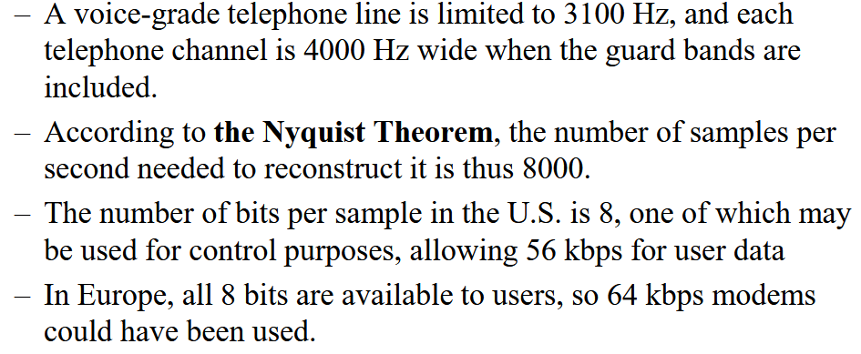
* circuit switching(connect) vs package switching(connectless)

### mobile

* cluster: a group that used all frequency possible
* handoff: switch station

## Chap 3 Data link Layer

* Framing, Error, Flow control
* Unacknowledged connectionless service(realtime, low error), Ack conless service(unreliable), Ack con service(long & unreliable)
* Byte count, Byte stuffing(PPP P2p protocal), Bit stuffing(USB), Code violation(an error to signal)
* Hamming code: use m+r bit, use hamming distance to choose the closest as thr right one, to detect d errors, need distance d+1 code, correct need 2d+1 code
* Minmal for m bit message need to handle all single error: for a n=m+r, every valid need n invalid, that means $(n+1)2^m \leq 2^n\rightarrow (m+r+1)\leq 2^r$
* Hamming code: 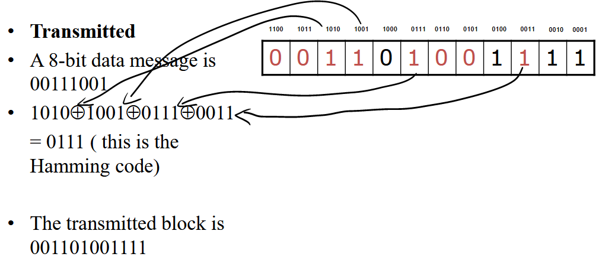 the xored result will be the errored bit if non-zero
* Conv code(n,m,K) from m bits to n bit using K-1 previous input block
* Reed-solomon code, LDPC code
* Error detect
    * parity: even parity: make even
    * interleaving & two-dimensional: get parity of different part
    * Cecksum:
        * 16bit internet checksum: 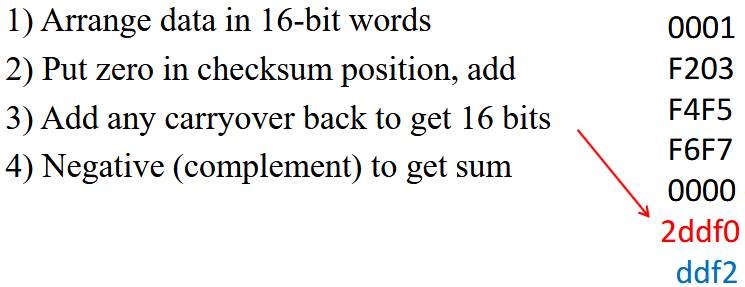, the reult of adding the check sum and normal will be ffff
        * CRC: add n-1 bit check sum that make the whole message divisable by the generator
* simple protocal:
    * stop and wait, sender wait for an ack before sending again
    * stop and wait on noisy: sender have a timer, timeout and resent if no ack, sender have sequence number to check if dupe that ack failed
    * 1 bit sequence is enough(only one frame allow on air)
* sliding window protocal:
    * Piggybacking: hook ongoing ack on the next data
    * 1 bit = stop and wait 
    * 一次最多传 2-way-tranmission-time/package length +1 个（第一个ack到达的延迟）
    * go back n: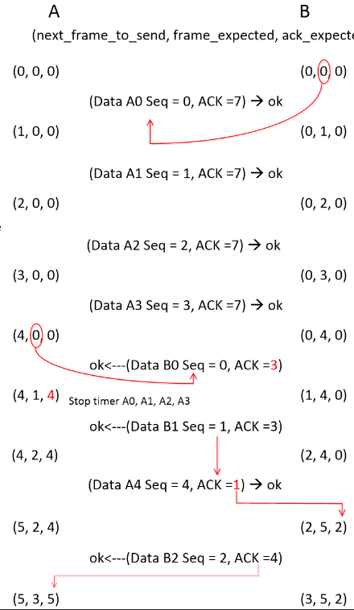
    * sequence count = window size + 1
    * selective recieve(NACK) can l=only have(window size / 2)
* ADSL, SONET, PPP(state machined), DOCSIS

## Chap 4 Medium Access Control sublayer

* FDMA: divide into N portions and static
* extern queueing thoery
* Carry sense
* ALOHA
    * pure: wait see if broadcasted by central, wait random if fail, vulnerable period=2T, max throughoutput at G=0.5 throughoutput=$0.5e^{-1}=18.4%$
    * slotted: max at G=1.0, throughoutput=$e^{-1}=36.8%$
* 1-persistent CSMA(Carrier Sense Multiple Access) send on idle, wait random on collision
* zero-persisent Check and send on idle, wait random and check again
* p-persistent: for slotted, when idle have probability of p to send
* CSMA/(C)ollision(D)etection: alternate idle and transmission, with slot time of 2*longest delay(at this point it is sure that no colission)
* A-bitmap protocal, declear usage first
* token passing, send message beforw passing token
* binary counting: every one have a code, if someone have a larger code than you, stop and wait
* limit-contention: contention is good at low load, collision-free is good at high load, group them to make sure every group have less than 5 station
    * adaptive tree walking:

### Wireless<a style="color:red"> !important</a>

* hidden ternmial(some one not in your range), exposed ternimal(some one can't effect your ap)
* MACA Multiple Access with Collision Avoidance
    * hearing RTS: must wait long enough for CTS to arrive
    * hearing CTS: must wait for data to finish

### Ethernet, 802.3

* hub-star, connectionless
* 8 byte preamble + 14 byte header
* header = destmac, srcmac, type(ethernet, larger than 0x600)/len(802.3, leq than 0x600)
* max data 1500bytes, min data 64bytes
* crc checksum
* binary expo backoff
* n collision-> next time $2^n-1$ slots, max at 10 after 16 爆
* hub is just gluing wires together, swtich can separate things
* nBase-T -> nMbps

## 802.11 Wifi

* CSMA/CA:
    * ack after finish, use ack to detect idle
    * DCF: every one do there own thing
    * PCF: AP cordinate
    * Physical sensing: idle just transmit, collison random time(For RTS)
    * Virtual sensing: both RTS and CTS cause others to NAV, a end of transmit(by node) or ACK(by station) will lift the NAV
    * Power: beacon frame used by ap for control 
    * use different interval for different frames

### Bridge

* Spanning tree for no loop
* everyone believe itself is root, broad cast choose lower to be root and jumps, same root choose shorter

### Misc

* 802.1Q: VLan

## Chap 5 Network Layer

* datagram and circuit based
* forwarding, routing
* routing algorithm: correctness, simplicity, robustness, stability, fairness and efficiency
* global routing, decentralized routing
* (L)ink (S)tate algorithm(dij)(OSPF), sink tree-> forward table
* Oscillation for dynamic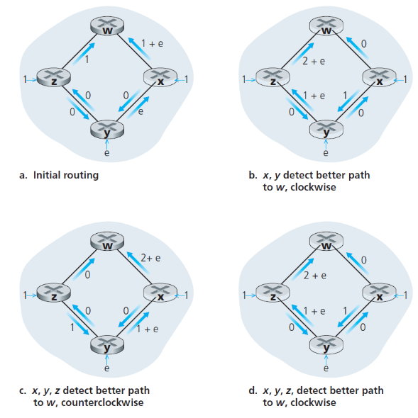
* (D)istance (V)ector(RIP, BGP), 根据邻居信息进行动态计算，本身只有自己和邻居信息
    * problem: inf counting(pass through it self?)
    * gateway router, AS
    * flooding: broadcast to neighbour
    * controled flooding: ibkt broadcast unbroadcasted package
    * spanning tree
    * reverse path forwarding(check if it is the normally used one, pass if yes)
* Anycast to any of the target
* IPv4
    * 16 bit add up
* The maximum payloads of different networks
    * Ethernet  1500 bytes
    * 802.11  2304 bytes (the maximum size of the frame body before encryption)
    * IP  65,515 bytes
* Path MTU (Path Maximum Transmission Unit)
* tranparent fragment vs untranparent(assmemble at end)
* next fragment start at offset << 3
* CIDR subnetting & route aggregation; use longest matching
* 0.0.0.0=boot, 255.255.255.255=target, 127.0.0.1=this 127.0.0.0/8
* dhcp: udp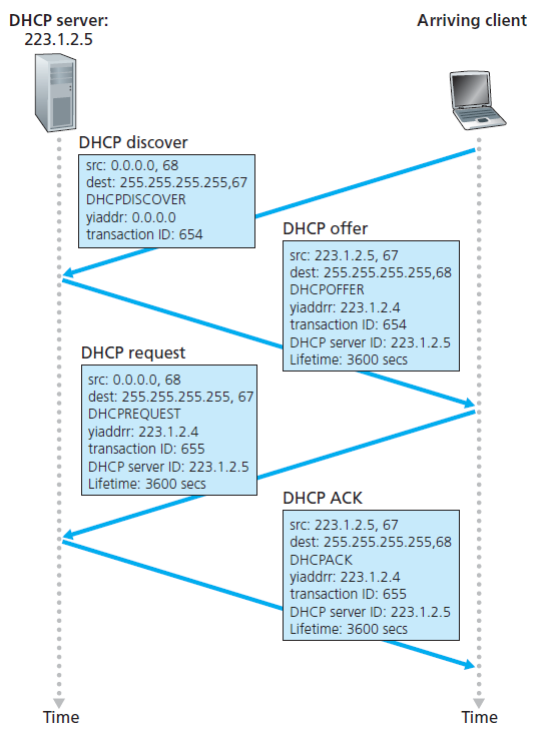
* ipv4 "::127.0.0.1"
* ARP: broadcast using ff:ff:ff:ff:ff:ff, respond with unicast right address
* rip: hop count, udp on 520, path limit 15
* ospf: ip protocal 89, equal cost multipath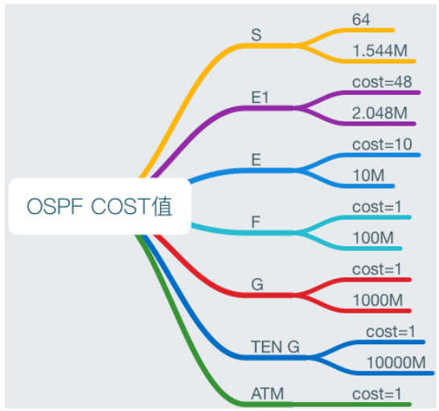
    * stub area: only one area boundary router
    * backbone
    * designated router
* BGP tcp 179
    * eBGP extern, iBGP internal
    * ASN ASnumber
* Multiprotocol Label Switching MPLS(circuit based)
    * add header between layer 2 and 3
    * 4 byte long
    * change label on every hop

## Chap 6 Transport Layer

* connection based & connectionless
* true end-to-end

### UDP

* header 8 bits, srcport dstport, length(not fully used because ip is 65515), checksum of everything(even with some ip header, add everything and ffff, pad data with zeros, protocal 17)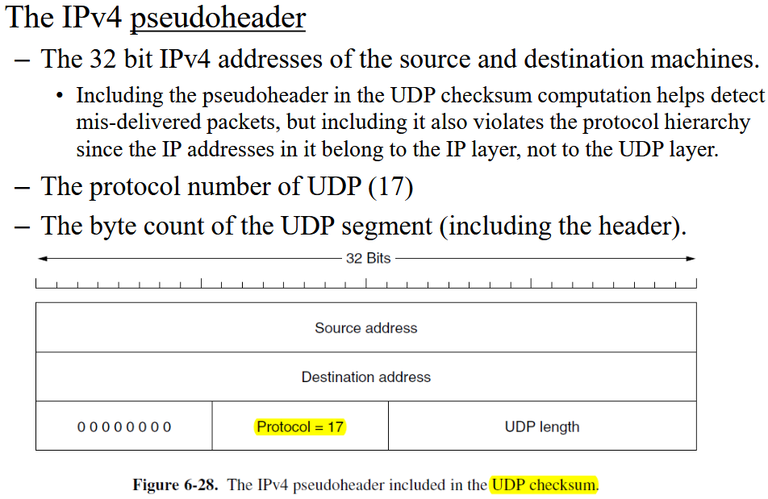
* RTP, DNS(53), SSDP
* RTP
    * 
* RTCP
    * like RTP, c for control

### TCP

* fullduplex p2p only
* byte stream, no message boundary
* Urgent flag
* 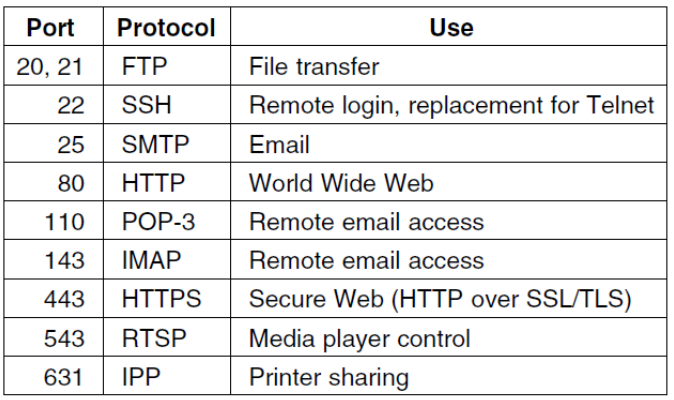
* sequence number for every byte
* ack num: next number i want
* ECE Explicit Congestion E?? -> CWR congetional window reduced, URGent, ACK(valid ack num), PSH: no buffer on arrive, SYN on first two handshake
* window size: how many can you send
* mandtory check some like udp with protocal 6
* MSS default 536+20 bytes
* SACK like NACK for ack after a lost package
* SYN message treat as 1 byte length, so add 1 to ACK
* handshake 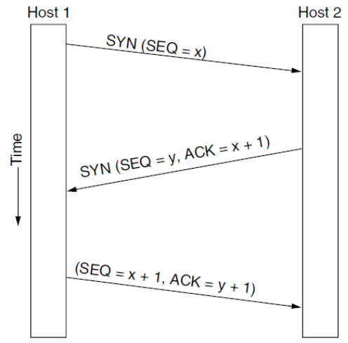 SYN, SYN+ACK, ACK, pure ack is length 0, pure ack can piggybacked to the first data, only request have ack=0
* SYN flood and SYN cookie defense
* release(after fin, wait two packages and release even no ack, fin take one sequnce): 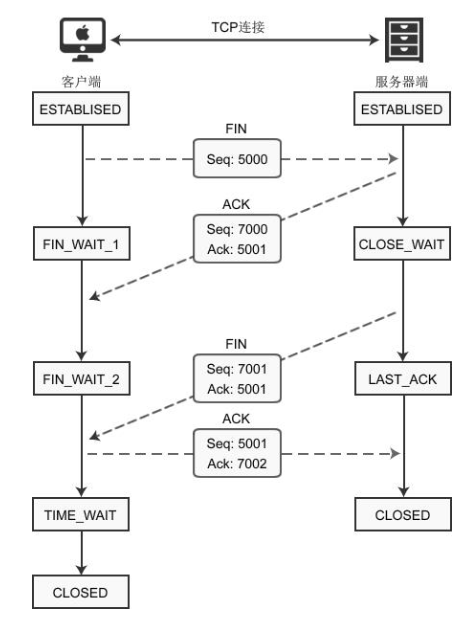
* TIME_WAIT for if final ack is lost, for two package life
* sliding window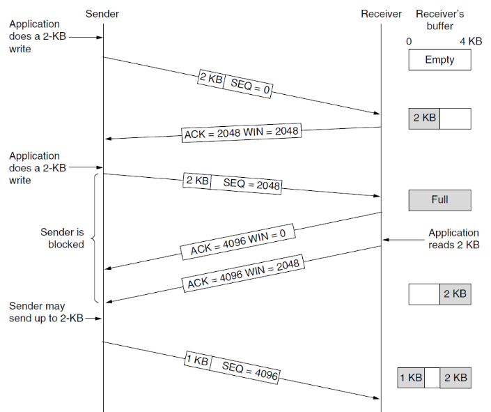
* dalay and piggyback ack for up to 500ms; Nagle’s Algorithm: send first piece and wait for ack to send the rest in one go; Clark’s Solution: when app read 1 byte at a time, send valid only when enough space is freed
* SRTT: 0.875*SRTT + 0.125*R(R round trip time)
* RTTVAR: 0.75 RTTVAR +0.25|SRTT - R|, RTO = min(1s, SRTT + 4*RTTVAR)
* Congestion:
    * AIML
    * congestion widow(sender)
    * flow control window(recver)
    * use time between ack to determine max data rate and use AIML to determine window size
    * use threshold, slow start until threashhold or timeout, half the window size, thresh will be half window, then AI
    * 3 dupe = loss, fast retransmit, treat dupe ack as arrive of later package
    * Tahoe
        * on loss, update the thresh and windowsize, restart slowstart from 1 windows size
    * Reno
        * FastRecovery 
        * half the thresh and only lower to thresh, then AI
* SACK, 3 sets of ranges
* BBR: find the point when RRT start to increase and dilivery rate stoped to increase
    * Total data in flight = BtlBW $\times$ RTProp
    * BtlBW = max diliever rate
    * RTProp = min RRT

## Chap 7 Application layer

* DNS
    * udp
    * dns spoofing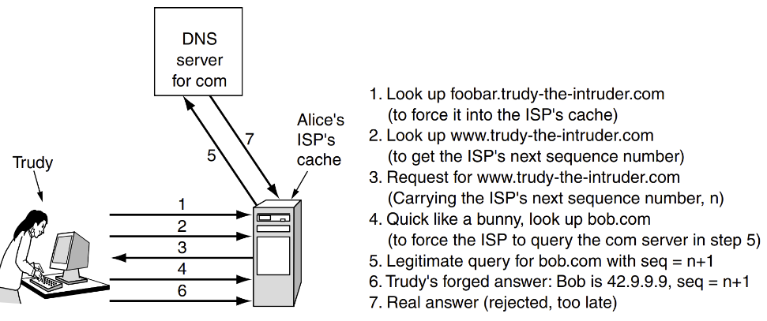
* FTP
* Email
    * SMTP: TCP25
    * MIME: like http
    * multimedia(multipart/alternative), boundary, --boundary--
* HTTP
    * http2 need ot come back in same order
    * http3 quic(udp)
    * have package number for every package